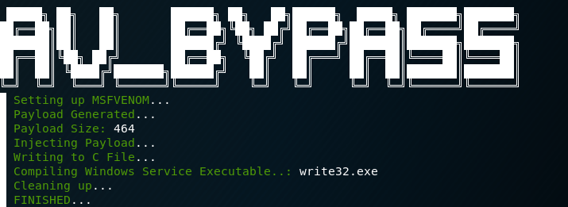
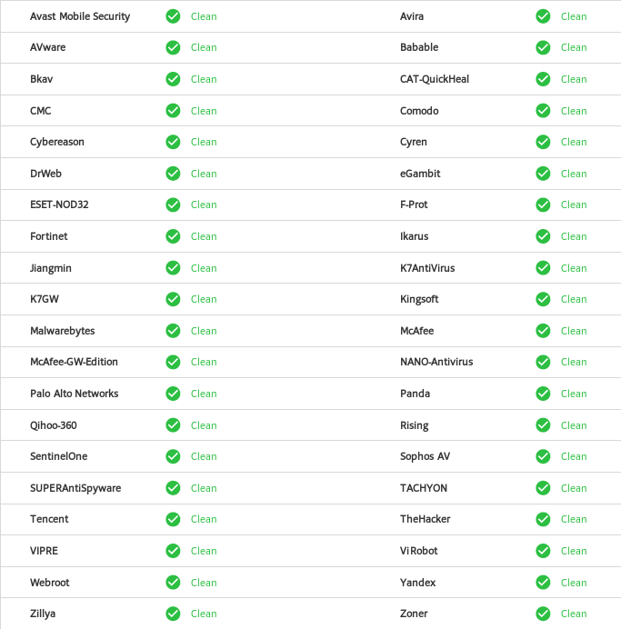

 

# Red Team Nightmare (AV Bypass)  :
You made your way into an interactive box, where you need to use some privilege escalation techniques to gain system. This isn't a post about the various techniques, but it's about evading the anti-virus for your engagement (From going interactive to active).

The usual top applications would be veil-framework or cobalt-strike. The issue with using this applications out-of-the-box is that they always have the same signature. Cobalt-strike mentions that major anti-virus product likes to write signatures for the executables in Cobalt Strike’s trial each time there is a release.

My goal wasn't to get 0/64 on virustotal, but to bypass the top tier AV providers (Avast, ESET, Malwarebytes, McAfee, Sophos AV) and continue with our engagement. 

>With the modifications done below, the service executable gets about **15/64** on virustotal, and also pass all of the top tier providers above.
---
### Breakdown:

When you use Veil/Cobalt-Strike/Metaspolit to create your executable, it will first generate a shellcode and than find it's corresponding executable file where the application will inject the shellcode in the 'Payload' memory address of the executable. This 'Payload' memory address allocates a buffer of usually 4096 bytes and starts with the string 'Payload', not really hiding what it is.

From doing numerous testing, I modified the service executable's template to allow for the shellcode to not be 'injected' into the skeletons buffer (as told above), but more of adding it directly to the 'C' file itself. 

Moving Forward, by default a buffer of 4096 is automatically set with the heading 'Payload', if your shellcode is less than that (It will be by far), it will than nopsled it's way to the end. AV can set a signature of X amount of A's (nopsled). What I did instead will take the shellcode size, and make that the default buffer space, nops not needed.

##### Quick overview of what I changed:

- Shellcode directly into C file to be compiled.
- No preset  allocate buffer
- Randomized various variables and function names, changes every compile.
---
### AV_Bypass.py

With all that said, I created a python script that can do the above very seamlessly. It will request an IP and PORT to callback to, make a shellcode, inject it into a set template, and compile the service executable for you all in one go. 

The callback can either be a meterpreter shell, or cobalt-strike beacon.

##### Prerequisites:
- msfvenom
- i686-w64-mingw32-gcc

#### Windows Side of things:

With the newly created Windows Service Executable, you can create a Windows service on the box with:
```bash
sc create write32 binPath= "C:\-Path to service executable.exe"
```
>The 'write32' would be the process name we create, in this case we'll match the exectuable file.
```bash
sc qc write32
```
>Verify that the we added the service and the right path is listed.
```bash
sc start write32
```
>After the service has started, check back your meterpreter shell or cobalt-strike listerner. SUCCESS!

Just want to make another note that there is a difference between a regular Windows Exectuable and a Windows Service Executable.

- **Windows EXE** is a Windows executable.
- **Windows Service EXE** is a Windows executable that responds to Service Control Manager commands. You may use this executable to create a Windows service with sc or as a custom executable with the Metasploit® Framework's PsExec modules.

---
 
